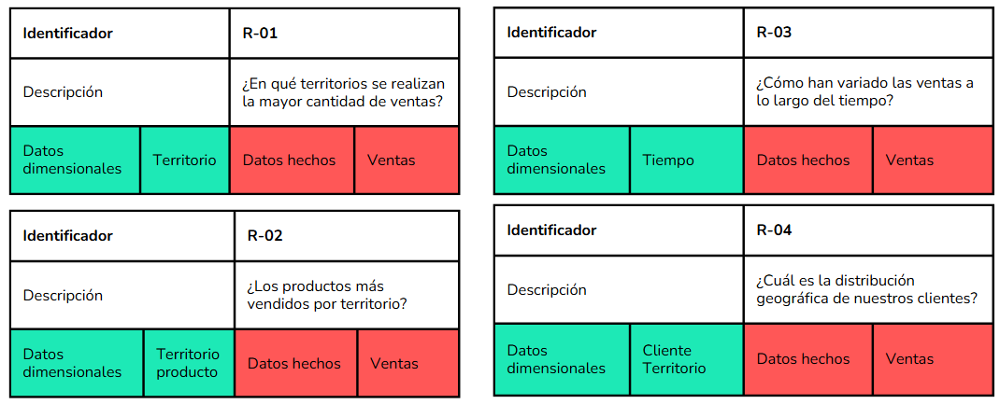
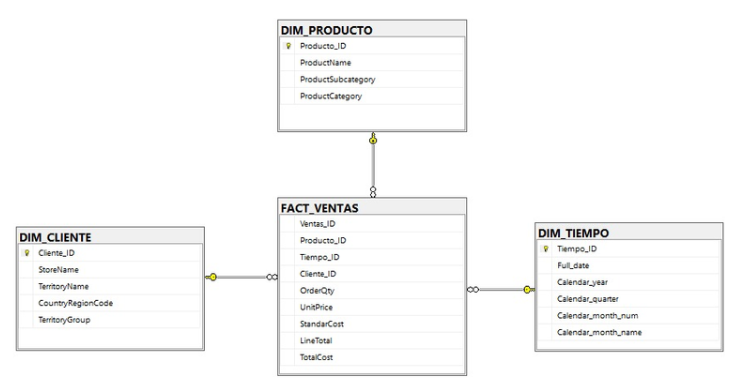
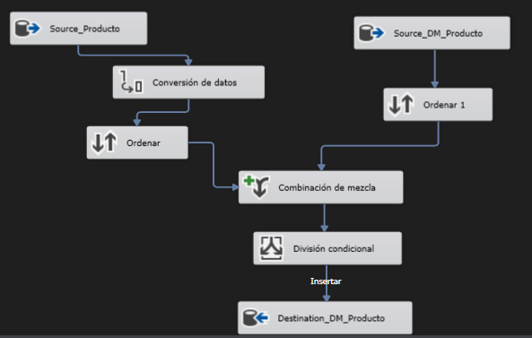
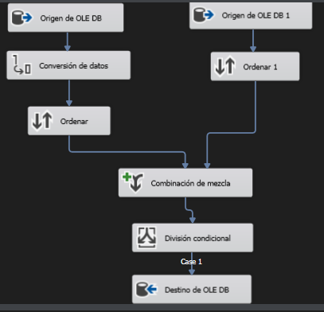
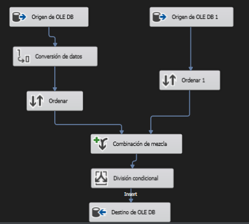
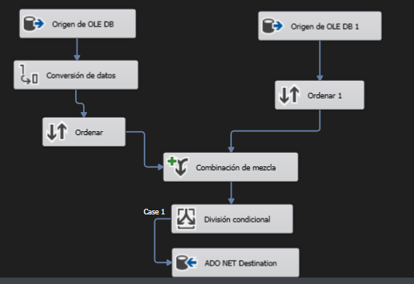
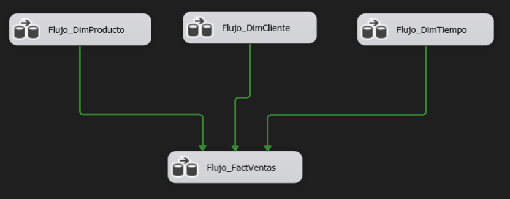
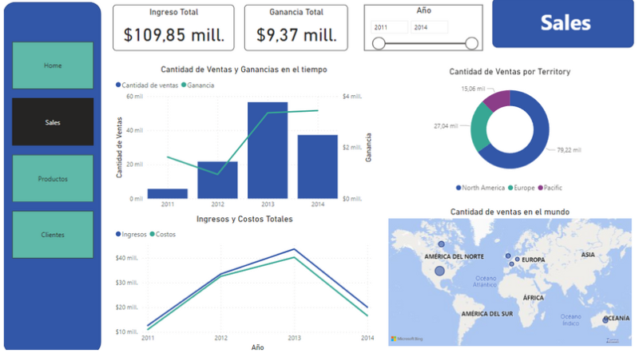
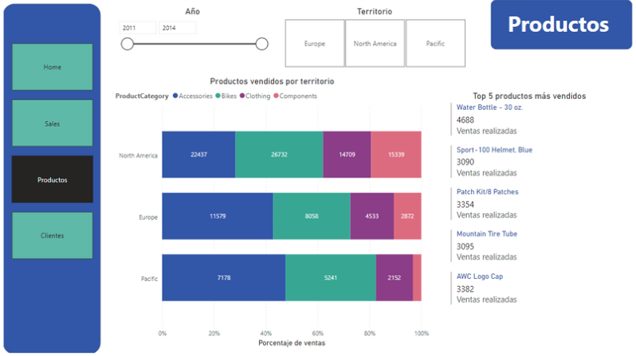
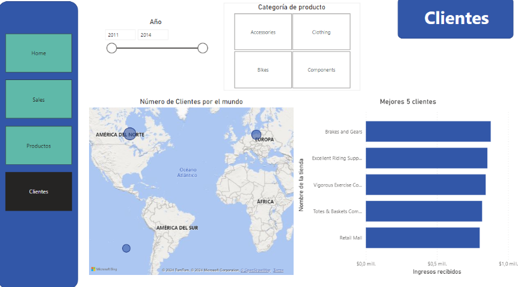

# Análisis del área de ventas de la base de datos AdventureWorks

## Planificación del proyecto

### Objetivos

- Generar información precisa y oportuna para Adventure Works a partir de sus requisitos planteados.
- Implementar un proceso ETL para generar un Data Mart a partir de la base de datos transaccional de la empresa.
- Analizar los datos mediante el uso de Power BI, lo que permitirá el desarrollo de Dashboards donde estos datos serán presentados a los usuarios finales.

### Alcance

El presente proyecto busca ayudar con la gestión del área de ventas de la empresa Adventure Work y apoyar a la toma de decisiones de la misma.

### Aspecto generales de la empresa

AdventureWorks es una base de datos transaccional que representa una empresa de ventas de bicicletas (Adventure Works Cycles) se encuentra almacenada sobre el Github de Microsoft. Adicionalmente, incluye distintos tipos de escenarios tales como ventas, compras, producción, gestión de contactos (clientes, empleados y proveedores) y recursos humanos.

## Requerimientos del Negocio

## Data Modeling

Implementación del Data Mart.

El proyecto utiliza el modelo estrella conformado por las siguientes tablas:

- FACT_VENTAS: Se registran los movimientos de las ventas realizadas.
- DIM_CLIENTE: Se registran los clientes de la empresa.
- DIM_PRODUCTO: Se registran los productos de la empresa.
- DIM_TIEMPO: Se registran las fechas de las órdenes de compra.

## ETL

El proceso ETL consta de 3 pasos que permiten la integración de datos desde el origen (BD transaccional) hasta el destino (Data Mart): extracción de datos, transformación de datos y carga de datos.

### Data Flow Dim_Producto

### Data Flow Dim_Cliente

### Data Flow Dim_Tiempo

### Data Flow Fact_Ventas

### General Control Flow

## Dashboards

## Conclusiones

- Existe un creciente aumento en la cantidad de ventas y ganancias a partir del 2012.
- A pesar de que las ventas y los ingresos registrados hasta febrero del 2014 son menores a todo el 2013, las ganancias ya han sido superadas. Esto se debe a que el costo por los productos ha disminuido con respecto al anterior año.
- En Europa y Australia, los accesorios son los productos más vendidos. Mientras que en América del Norte, son las bicicletas.
- El producto más vendido es la botella de agua de 30 oz.
- La mayor densidad de clientes se encuentra en América del Norte.
